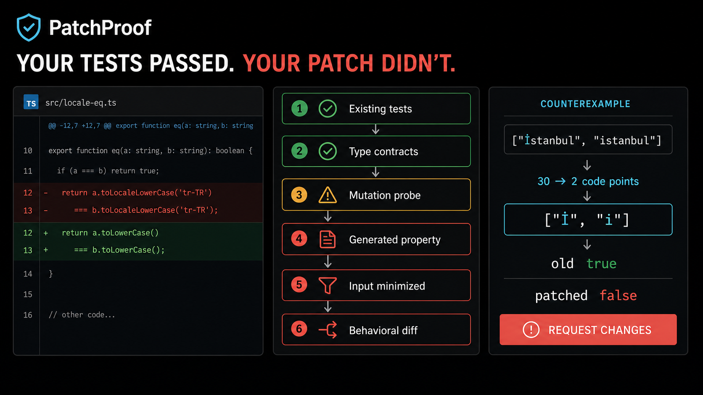
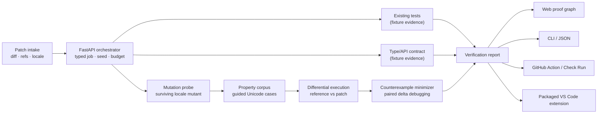

# PatchProof

**Adversarial software verification for human- and AI-generated patches.**

PatchProof does not ask only whether the existing tests pass. It asks whether it can construct an input that makes the patch violate an invariant—and only reports a defect when it has executable evidence.



> The image above is an illustrative product preview, not a runtime screenshot. It is intentionally limited to the implemented six-stage Unicode-locale demo. The interactive console replays the same deterministic evidence represented by the Python verifier.

## Why this project exists

An all-green test suite proves only that the cases already encoded by that suite passed. PatchProof coordinates additional verification strategies, tracks what each strategy actually established, and explicitly reports what remains outside the execution budget.

The included scenario models a realistic regression:

```diff
- return a.toLocaleLowerCase(locale) === b.toLocaleLowerCase(locale)
+ return a.toLowerCase() === b.toLowerCase()
```

All original tests pass. A mutation-guided property probe targets the removed locale branch, finds a Turkish case-mapping divergence, and minimizes:

```text
["İSTANBUL PORTAL", "istanbul portal"]
→ 14 accepted reductions, all preserving the failure
→ ["İ", "i"]

reference implementation (tr-TR): true
patched implementation:           false
```

The result is a generated regression test and a **request changes** recommendation—not a speculative model opinion.

## What is implemented

- A responsive Next.js/TypeScript verification console with:
  - patch diff and original-test status;
  - deterministic worker animation;
  - proof graph with pass, warning, and failure branches;
  - generated-property failure and shrink trace;
  - old/patched execution comparison;
  - evidence confidence, verified properties, unverified behavior, generated test, performance delta, API compatibility, and recommendation;
  - keyboard-accessible controls and reduced-motion support.
- A typed Python/FastAPI verifier with:
  - content-addressed job IDs derived from every request field;
  - deterministic timestamps, seed, corpus, execution budget, and reports;
  - mutation-guided input ordering;
  - property evaluation;
  - paired delta-debugging, character deletion, and a replayable shrink trace;
  - differential reference/patched execution;
  - typed reports and an in-memory job lookup API.
- A local `patchproof` CLI with human-readable and JSON output.
- A runnable GitHub integration with:
  - a repository-local composite Action and pull-request/workflow-dispatch check;
  - credential-free Checks API payload and job-summary generation;
  - optional token-authenticated check posting with no checked-in credentials;
  - a FastAPI payload-preview endpoint and tested framework-neutral adapter.
- A packaged VS Code extension with three commands, workspace-trust handling,
  shell-free verifier execution, timeout/output limits, diagnostics, and a full
  output-channel report.
- Frontend source tests, Python unit/API/CLI tests, and a one-command verification script.

## Architecture



The web UI and Python service intentionally share the same conceptual report shape. The UI’s confidence score describes **evidence quality**, not the probability that a patch is correct. PatchProof does not claim exhaustive formal verification.

## Quick start

Prerequisites:

- Node.js 22.13 or newer
- Python 3.11 or newer

### Web app

```bash
npm install
npm run dev
```

Open `http://localhost:3000`, then select **Replay verification**.

Production check:

```bash
npm run build
npm test
npm run lint
npm run typecheck
```

### Python verifier and CLI

```bash
python3 -m venv python/.venv
python/.venv/bin/pip install -e "python[dev]"
python/.venv/bin/patchproof demo
```

Machine-readable report:

```bash
python/.venv/bin/patchproof demo --format json
```

CI-style non-zero exit when a finding exists:

```bash
python/.venv/bin/patchproof demo --fail-on-finding
# exits 2 after printing the executable finding
```

### GitHub Check

Generate a complete Checks API request without network access:

```bash
GITHUB_REPOSITORY=owner/repository \
GITHUB_SHA="$(git rev-parse HEAD)" \
python/.venv/bin/patchproof github-check
```

The checked-in [composite Action](./.github/actions/patchproof/action.yml) and
[workflow](./.github/workflows/patchproof.yml) run the same evidence path and
write a GitHub job summary. A workflow run is itself visible as a repository
check. `workflow_dispatch` can additionally post a separate Check Run when
`post_check` is selected.

The checked-in pull-request workflow is an **integration smoke check**: it
proves that the CLI, report, and GitHub presentation execute on a GitHub runner.
It does not analyze the pull request’s diff. Because the built-in scenario
contains a known regression, opting into `post_check` deliberately creates a
separate Check Run with a `failure` conclusion.

Posting is opt-in and reads the token only from the environment:

```bash
export GITHUB_TOKEN="token with checks:write"
python/.venv/bin/patchproof github-check \
  --repository owner/repository \
  --sha "$(git rev-parse HEAD)" \
  --post
```

Do not place a token in command arguments or configuration files. GitHub
Enterprise users can set an HTTPS `GITHUB_API_URL`. See GitHub’s official
[workflow permission reference](https://docs.github.com/en/actions/reference/workflows-and-actions/workflow-syntax#permissions)
and [Check Runs API](https://docs.github.com/en/rest/checks/runs).

### VS Code extension

Build and inspect the installable VSIX:

```bash
npm run package:vscode
unzip -t integrations/vscode-extension/dist/patchproof-vscode-0.1.0.vsix
code --install-extension \
  integrations/vscode-extension/dist/patchproof-vscode-0.1.0.vsix
```

Install the Python CLI as shown above, open this workspace, then run
**PatchProof: Run Deterministic Demo**. The extension auto-detects the
project-local virtual environment; `patchproof.executable` overrides it.
Starting a process requires workspace trust. The process runs without a shell,
is killed at the configured timeout, and cannot emit more than 1 MiB.
These controls follow VS Code’s official
[Workspace Trust extension guidance](https://code.visualstudio.com/api/extension-guides/workspace-trust);
the package is produced with the documented
[`vsce package` workflow](https://code.visualstudio.com/api/working-with-extensions/publishing-extension).

Run all checks:

```bash
./scripts/verify-all.sh
```

## API

Start the service:

```bash
python/.venv/bin/uvicorn patchproof.api:app --app-dir python/src --reload
```

Interactive OpenAPI docs are available at `http://127.0.0.1:8000/docs`.

### Submit a verification job

```bash
curl -s http://127.0.0.1:8000/v1/verify \
  -H 'content-type: application/json' \
  -d '{
    "repository": "demo/search-service",
    "base_ref": "main",
    "patch_ref": "8f29d1a",
    "patch": "demo://unicode-locale-regression",
    "locale": "tr-TR",
    "seed": 20260725,
    "max_examples": 64
  }'
```

The MVP executes synchronously and returns a completed `JobEnvelope`. Retrieve the same in-memory job with:

```bash
curl -s http://127.0.0.1:8000/v1/jobs/pp_496349FCE8
```

Endpoints:

| Method | Path | Purpose |
|---|---|---|
| `GET` | `/health` | Liveness probe |
| `POST` | `/v1/verify` | Validate input and execute a typed verification job |
| `GET` | `/v1/jobs/{id}` | Retrieve a report created in this process |
| `POST` | `/v1/integrations/github/check-payload` | Build a credential-free GitHub Checks API payload |

## Pipeline details

1. **Baseline evidence** records the demo repository’s original test and type-contract results.
2. **Mutation probe** observes that replacing locale-aware folding with generic `lower()` survives the original suite.
3. **Mutation guidance** moves dotted/dotless-I pairs to the front of a deterministic Unicode corpus.
4. **Property execution** evaluates the contract: values equivalent under the declared locale must remain equivalent.
5. **Differential execution** requires the reference to satisfy the contract and the patch to violate it.
6. **Minimization** deletes paired suffixes, then individual code points, while replaying the same executable predicate. The report retains all 15 states (the original plus 14 accepted reductions), not only the final pair.
7. **Reporting** includes proof, gaps, generated regression test, compatibility/performance fixtures, and a concrete next action.

The job ID hashes the canonical serialization of the entire validated request, so requests that differ by base reference, patch reference, locale, seed, budget, repository, or patch cannot silently overwrite each other. The fixed seed affects job identity and timestamp; corpus ordering and shrinking are deterministic. Repeating the same request produces a byte-equivalent Pydantic model.

### Evidence taxonomy

PatchProof distinguishes executable findings from demo fixtures:

| Strategy from the product design | MVP status | Evidence in this repository |
|---|---|---|
| Existing unit/integration tests | Fixture | A typed check records the built-in demo repository’s `214 / 214` baseline; PatchProof does not claim to execute an external repository |
| Test amplification | Executable output | The minimized pair is emitted as a syntactically valid pytest regression test |
| Property/metamorphic testing | Executable | A locale-equivalence implication is evaluated over a deterministic, mutation-guided Unicode corpus |
| Mutation testing | Fixture + executable guidance | The surviving locale-removal mutant is a fixture; its guidance changes corpus ordering and reaches the executable property |
| Fuzzing | Deterministic corpus MVP | Bounded Unicode cases are executed in a stable order; this is not coverage-guided fuzzing |
| Differential execution | Executable | Reference and patched functions run on the same minimized input |
| Counterexample minimization | Executable | Every accepted reduction is retained and rechecked against the divergence predicate |
| Type/static/API compatibility | Fixture | Typed report fields explicitly label the unchanged demo signature; no external checker is invoked |
| Complexity/performance | Fixture | The `−3.1%` value is labeled a deterministic fixture and must not be used as repository benchmark evidence |
| Resource leaks and race schedules | Unverified | Reported as gaps rather than passes |
| Stateful model-based testing | Not implemented | A future sandbox runner can add this without changing report consumers |

An LLM is not required for the built-in run. No finding is accepted solely because a model suggested it.

## Generated regression test

```python
def test_equal_folded_tr_tr_counterexample():
    assert equal_folded("İ", "i", locale="tr-TR") is True
```

## Integrations

### GitHub

`patchproof.github_check` maps the complete review packet—confidence, verified
properties, explicit gaps, generated tests, counterexamples, performance,
compatibility, and recommendation—to a Checks API body. The CLI defaults to a
credential-free dry run. `--post` requires `GITHUB_TOKEN`, validates an HTTPS
API origin, sends a 15-second request, and never serializes the token into the
report. Posting is covered with a fake opener; tests never call GitHub.

The composite Action installs the Python package into an isolated runner
environment, writes JSON under `RUNNER_TEMP`, and appends a Markdown summary to
`GITHUB_STEP_SUMMARY`. The included workflow uses `pull_request` rather than
`pull_request_target`, preventing execution in a privileged base-repository
context. Its result is a real Actions check for this repository.

This does not constitute a registered webhook GitHub App. A distributable App
still requires GitHub registration, an installation flow, a webhook secret,
delivery verification, checkout sandboxing, and durable job storage. Those
credentials and external resources are intentionally absent.

### VS Code

`integrations/vscode-adapter.ts` remains the testable host-independent boundary.
`integrations/vscode-extension/` is the concrete host: it bundles that adapter,
registers commands, starts the CLI, maps counterexamples to
`DiagnosticCollection`, and retains the JSON report in a `LogOutputChannel`.
The VSIX contains no credentials, telemetry, network client, or update
mechanism. It is locally installable but is not published to the VS Code
Marketplace.

## Verification

The project’s local verification command covers:

| Surface | Check |
|---|---|
| Frontend | vinext/Cloudflare-compatible production build |
| Frontend | Node source/metadata tests |
| GitHub | Payload, job summary, dry-run CLI, missing-token, secure-origin, mocked POST, API, Action/workflow contract tests |
| VS Code | strict extension typecheck, esbuild bundle, VSIX packaging, archive integrity, manifest and security-control tests |
| Frontend | ESLint |
| Frontend | TypeScript strict typecheck |
| Engine | Unicode reference and patched behavior |
| Engine | deterministic 14-step minimization to `["İ", "i"]`, with every trace entry rechecked |
| Orchestrator | complete and repeatable report |
| API | health, submit, retrieve, GitHub payload, 404, invalid-budget, unknown-field, and unsupported-patch paths |
| CLI | JSON, human summary, GitHub dry-run/summary/post failure, inconclusive run, invalid input, and exit-code contracts |
| Smoke | CLI report parsed by `json.tool` |

The web console is a deterministic presentation of the built-in report rather than an API client. Its replay control resets the proof graph and reveals all six workers in order. The Python service remains the authoritative executable engine.

## Scope and limitations

This is a portfolio-quality, locally executable MVP, not a safe arbitrary-code execution service.

- The included verifier accepts only `demo://unicode-locale-regression` and rejects unsupported patch payloads with HTTP `422`. It does **not** clone or run untrusted repositories.
- Existing-test, type, performance, and API-compatibility results are explicit demo fixtures; the Unicode property, differential result, minimizer, API, and CLI are executable.
- Jobs are synchronous and stored in process memory.
- There is no authentication, database, queue, container sandbox, registered
  webhook GitHub App, or Marketplace-published VS Code extension. The local
  Action/check publisher and installable VSIX are executable.
- The property corpus is deterministic and purpose-built; production should add adapters for Hypothesis, fuzzers, mutation tools, type checkers, profilers, and hermetic test runners.
- Unicode caseless matching is domain-dependent. This demo models one explicit `tr-TR` application contract; it is not a universal identity algorithm.
- “No counterexample found” means only “not found within this strategy and budget.”

For production, isolate every checkout in an ephemeral, network-disabled sandbox; pin toolchains and dependency locks; verify repository and webhook identities; redact secrets; cap CPU, memory, process count, output, and wall time; and persist content-addressed evidence.

## Research basis

PatchProof is grounded in execution-first verification:

- [SWE-bench](https://arxiv.org/abs/2310.06770) introduced realistic repository-level software engineering tasks; its verified subset emphasizes human-validated evaluation instances.
- [SWE-smith](https://arxiv.org/abs/2504.21798) describes scalable construction of executable software-engineering task data.
- [Hypothesis](https://hypothesis.readthedocs.io/en/latest/reference/api.html#hypothesis.Phase) separates generation, targeted mutation, shrinking, and explanation phases; PatchProof’s MVP mirrors those responsibilities with a deterministic corpus and minimizer.
- Zeller and Hildebrandt’s original [delta debugging paper](https://www.st.cs.uni-saarland.de/papers/tse2002/tse2002.pdf) motivates systematic reduction of failure-inducing inputs.
- Unicode’s normative [SpecialCasing data](https://www.unicode.org/Public/UCD/latest/ucd/SpecialCasing.txt) documents context- and language-sensitive mappings, including Turkish dotted and dotless I.
- [FastAPI request models](https://fastapi.tiangolo.com/tutorial/body/) provide runtime validation and OpenAPI schema generation from Pydantic types.

## Repository map

```text
app/                              Next.js verification console
.github/actions/patchproof/       Repository-local composite GitHub Action
.github/workflows/                Pull-request and manual integration check
integrations/github-check.ts      TypeScript Checks API adapter
integrations/vscode-adapter.ts    Editor-independent diagnostic boundary
integrations/vscode-extension/    Buildable, packaged VS Code extension
public/demo/                      README preview asset
python/src/patchproof/            FastAPI, CLI, engines, GitHub publisher
python/tests/                     Engine, API, integration, and CLI tests
scripts/verify-all.sh             Complete local verification
tests/                            Frontend and integration source tests
```

## License

MIT — see [`LICENSE`](./LICENSE).
